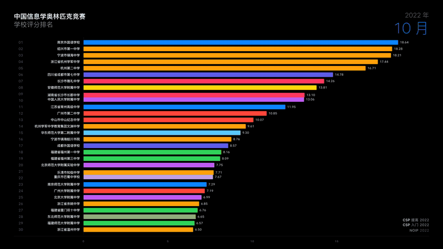

# OI Chart Race

> 用 [OIerDb](https://oier.baoshuo.dev) 的全量公开数据，从 2004 年起逐月回放中国信息学奥林匹克竞赛的 **学校积分排名** 演变，输出 4K bar-chart-race 动画。
>
> Animated bar-chart-race of Chinese OI school rankings, driven by [OIerDb](https://oier.baoshuo.dev) public data — from 2004 to today, month by month, 4K.



> 完整 4K MP4 在 [GitHub Releases](../../releases) 下载（每周一自动更新）。

## 特点 · Features

- **数据完全来自 OIerDb 公开仓库** — 不抓站、不爬数据，用官方 git submodule
- **两种打分公式可选** — 沿用 OIerDb 官方的指数衰减 (`legacy`)，或本项目提出的有界谐和衰减 (`v2`)，详见 [`docs/FORMULAS.md`](docs/FORMULAS.md)
- **真正连续的动画** — 单调三次 Hermite 样条 + Gaussian 平滑排名 + 末帧 swap 收敛，无月度顿挫，最后一帧不卡半
- **2004 平滑起点** — 早年只有 NOI 一场赛事，里程碑合并到 2005 Dec，2004 全年都有平滑上升
- **统一深色 Apple Keynote 风格** — Pure-black 底 + 苹方 SC + SF Pro + iOS 系统色
- **省份编码颜色** — 上榜过的 19 个省各一种颜色，竞赛大省最大化区分
- **赛事事件 ticker** — 月份切换到 NOI/NOIP/CSP/IOI 时浮入，单调 slot 算法保证浮起后不会回落
- **一键流水线** — `make video` 出主体动画，`make final` 套封面 + BGM 出成片

## 快速开始 · Quick Start

```bash
# 0. 系统依赖
brew install ffmpeg node                # macOS
# Linux: sudo apt install ffmpeg fonts-noto-cjk && nvm install 20

git clone --recursive https://github.com/lailai0916/oi-chart-race
cd oi-chart-race
make install                            # python venv + npm deps + submodule init

# 1. 出主体动画 (4:26, ~250 MB)
make video                              # → output/ranking_race.mp4 (3840×2160 @ 120fps)

# 2. (可选) 后期合成：封面 + 片尾 + BGM (需在仓库根放置 time.mp4 BGM)
make final                              # → output/ranking_race_final.mp4 (4:34)
```

完整可用的 `make` 目标：

```bash
make help          # 显示所有目标
make doctor        # 检查上游是否有未映射的赛事类型 / 省份
make update-data   # 拉取最新 OIerDb 数据
make snapshot      # 只重算 snapshots.parquet
make json          # 只导出 snapshots.json
make studio        # 打开 Remotion Studio 实时预览
make cards         # 重新生成片头 / 片尾 PNG
make final         # 套片头 + 片尾 + 音乐合成成片
make compare       # 跑 legacy ↔ v2 公式 Top-100 差异对比
make clean         # 删除渲染产物
```

## 流水线 · Pipeline

```
                ┌─────────────────────────────────────┐
                │  OIerDb-ng/OIerDb-data-generator    │
                │  (git submodule, AGPL-3.0)          │
                │  • data/raw.txt   ~29 万条记录       │
                │  • static/contests.json  138 场      │
                └────────────────┬────────────────────┘
                                 ▼
        ┌───────────────────────────────────────────────┐
        │  src/snapshot.py    formula = legacy | v2     │
        │  → output/snapshots.parquet  (Top-N × 月)     │
        │  → src/export_json.py                         │
        │  → remotion/public/snapshots.json             │
        └────────────────┬──────────────────────────────┘
                         ▼
        ┌───────────────────────────────────────────────┐
        │  remotion/src/BarChartRace.tsx  React + d3    │
        │  • PCHIP / 线性插值                            │
        │  • 排名 Gaussian 平滑 + 末帧收敛              │
        │  • 省份配色 · 单调 slot 赛事 ticker            │
        │  → output/ranking_race.mp4                    │
        └────────────────┬──────────────────────────────┘
                         ▼
        ┌───────────────────────────────────────────────┐
        │  tools/make_cards.py  (苹方 + SF Pro)         │
        │  tools/compose.sh     ffmpeg xfade + BGM      │
        │  → output/ranking_race_final.mp4              │
        └───────────────────────────────────────────────┘
```

更详细的设计取舍见 [`docs/ARCHITECTURE.md`](docs/ARCHITECTURE.md)。

## 配置 · Configuration

所有可调参数集中在 [`config.json`](./config.json)：

```jsonc
{
  "formula": "legacy",            // 'legacy' (OIerDb 官方) 或 'v2' (本项目提案)
  "displayTopN": 30,              // 视频中显示前几名
  "trackTopN": 50,                // 后台跟踪范围 (≥ displayTopN + 缓冲)
  "fps": 120,
  "framesPerMonth": 120,          // 1 月 = 1 秒
  "holdStartSec": 1.5,            // 起始定格秒数
  "holdEndSec": 3,                // 末尾定格秒数
  "smoothSigmaMonths": 0.15,
  "contestBadge": {
    "leadMonths": 0.3,            // 渐入窗口宽度（月）
    "holdMonths": 0.8,            // 全显持续时长
    "fadeMonths": 1.5,            // 渐出窗口宽度
    "tieSpreadMonths": 0.08       // 同月事件的微展开
  }
}
```

改完保存 → `make video` 自动重算所有产物。

省份配色在 [`remotion/src/colors.ts`](remotion/src/colors.ts)；赛事 → 月份映射在 [`src/month_mapping.py`](src/month_mapping.py)。

## 两种公式 · Two Scoring Formulas

| 维度 | `legacy` (OIerDb 官方) | `v2` (本项目提案) |
|---|---|---|
| 时间因子 | 指数 `1.25^(year-2000)` | 谐和 `1/(1+age/10)` |
| 数字范围 | 0 ~ 2,800,000+ | 0 ~ 20 |
| 历史影响 | 10 年前几乎归零 | 10 年前仍有 50% |
| 规模影响 | 校大 → 分高 | 每校 Top-15 OIer × Top-3 记录截断 |
| 长尾名次 | 给参加奖算分 | 30% 以后归零 |
| 解释成本 | 三段查表 + Decimal | 一条公式 |

完整论证、字段定义、想自加公式的同学请看 [`docs/FORMULAS.md`](docs/FORMULAS.md)。

## 后期合成 · Post-production

`make final` 把渲染好的主体动画包装成成片：

- 片头卡（6 秒，苹方 SC + SF Pro，2004 — 2026）
- 主体动画（自动 ffprobe 探测时长，改 `framesPerMonth` 后无需调整脚本）
- 片尾卡（6 秒，OIerDb 数据来源 + 项目链接）
- 全片背景音乐（自行准备 `time.mp4` 放仓库根；版权所有，**不会**提交到本仓库）

所有可调参数（淡入淡出、音量、CRF、preset 等）在 [`tools/compose.sh`](tools/compose.sh) 顶部，也可用环境变量临时覆盖：

```bash
BGM_START=30 MUSIC_VOL=0.7 AFADE_OUT=8 make final
```

## 协议 · License

**AGPL-3.0-or-later** — 本项目在运行时 `import` 上游 `OIerDb-ng/OIerDb-data-generator` (AGPL-3.0) 的模块，构成衍生作品，须同协议。完整条款见 [`LICENSE`](LICENSE)。

## 致谢 · Credits

- **数据 + 官方公式**：[@renbaoshuo (Baoshuo)](https://github.com/renbaoshuo) 维护的 [OIerDb-ng](https://github.com/OIerDb-ng)
- **可视化栈**：[Remotion](https://www.remotion.dev/) + [d3](https://d3js.org/)
- **字体**：苹方 SC + Apple SF Pro

如果在论文 / 视频 / 媒体中使用本项目生成的画面，烦请附上以上来源链接，谢谢 🙏

## 引用 · Citing

```bibtex
@misc{oi_chart_race,
  title  = {OI Chart Race: animated visualisation of Chinese OI school history},
  author = {lailai0916},
  year   = {2026},
  howpublished = {\url{https://github.com/lailai0916/oi-chart-race}},
  note   = {Data from OIerDb (https://github.com/OIerDb-ng), AGPL-3.0-or-later}
}
```
